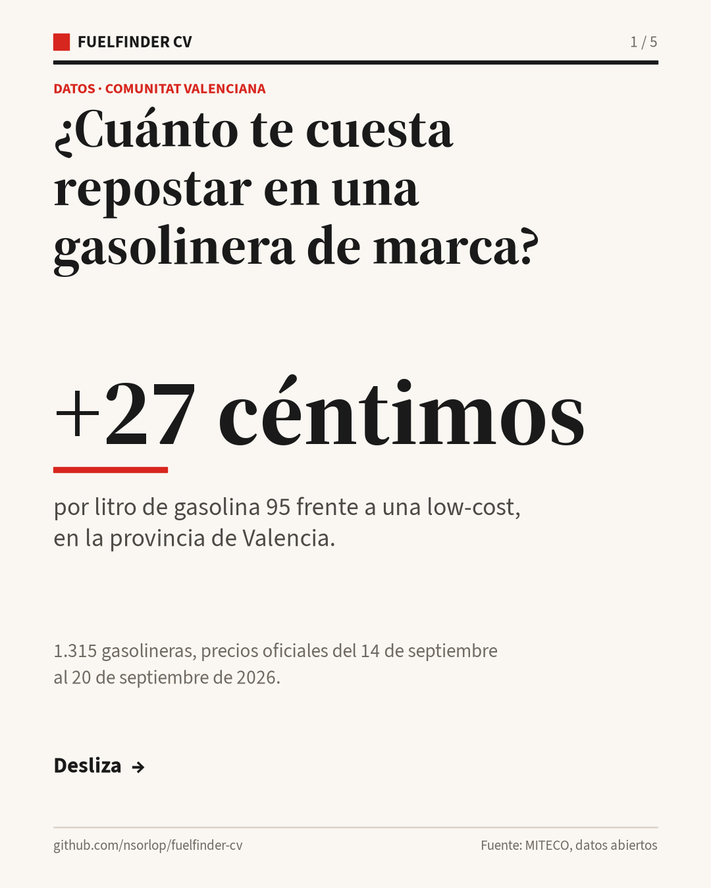
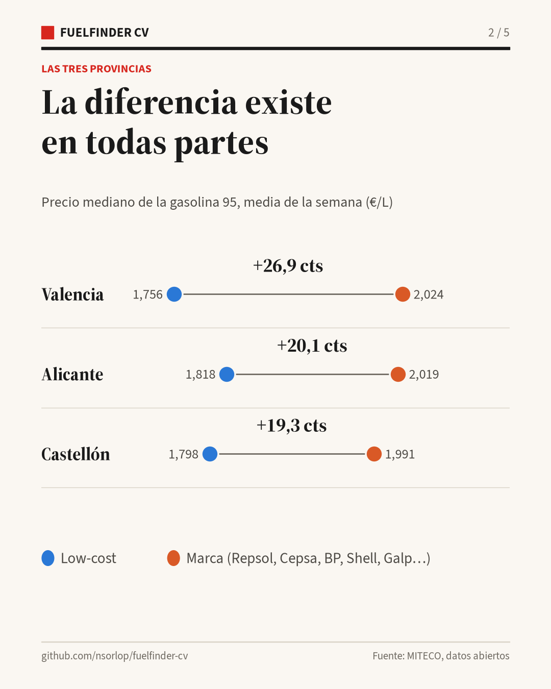
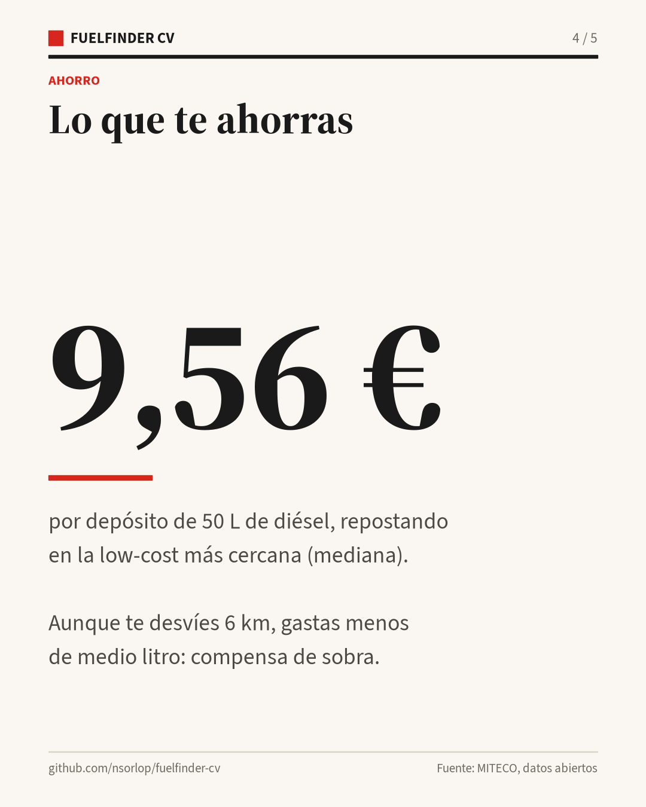

<h1 align="center">⛽ FuelFinder CV</h1>

<p align="center">
  <b>¿Cuánto te cuesta repostar en una gasolinera de marca en la Comunitat Valenciana?</b><br>
  Mapa de las 1.315 gasolineras con precios oficiales, y la más barata cerca de ti.
</p>

<p align="center">
  <a href="https://nsorlop.github.io/fuelfinder-cv/"><b>→ Abrir el mapa</b></a>
</p>

<p align="center">
  <a href="https://github.com/nsorlop/fuelfinder-cv/actions/workflows/ci.yml"></a>
  <a href="https://github.com/nsorlop/fuelfinder-cv/actions/workflows/refresh.yml"></a>
  
</p>

<p align="center">  </p>

## El dato

Media de la semana del 14 al 20 de septiembre de 2026, con los precios oficiales del Ministerio:

| Zona | Gasolina 95, marca | Gasolina 95, low-cost | Sobreprecio | Marcas con una low-cost a menos de 3 km | Ahorro por depósito de 50 L de diésel |
|---|---:|---:|---:|---:|---:|
| **Valencia** | 2,024 € | 1,756 € | **+26,9 cts/L** | **66 %** | **9,56 €** |
| Alicante | 2,019 € | 1,818 € | +20,1 cts/L | 63 % | 7,82 € |
| Castellón | 1,991 € | 1,798 € | +19,3 cts/L | 53 % | 11,43 € |
| Comunitat Valenciana | 2,017 € | 1,796 € | +22,1 cts/L | 63 % | 9,16 € |

La diferencia es estable: en Valencia osciló entre 26 y 28 céntimos por litro los siete días.

## Qué hace

- **Mapa** de todas las gasolineras de la Comunitat, coloreadas de más cara a más barata.
- **Cerca de ti**, con el radio que elijas (de 1 a 50 km) y tres criterios:
  - **Mejor precio**: la más barata dentro del radio.
  - **Más cercana**: la que tienes más a mano.
  - **Compensa más**: la que menos te cuesta *de verdad*, porque suma al depósito el combustible del desvío (ida y vuelta en línea recta, a 6 L/100 km). Con radios grandes, la más barata puede no compensar el viaje.
- **Tiempo real**: sigue tu ubicación mientras te mueves y recalcula la búsqueda sola. La ubicación nunca sale del navegador.
- **Filtros** por combustible (gasolina 95 o diésel) y por tipo de gasolinera.
- **La comparativa** de marca frente a low-cost por provincia.

## Cómo funciona

```
fetch ──► normalize ──► brands ──► analyze ──► build
MITECO    coma decimal   marca /     medianas   JSON para la web
(7 días)  y coordenadas  low-cost    por día    + carrusel de LinkedIn
```

La web es **estática** (GitHub Pages, Leaflet y OpenStreetMap): no hay servidor, y todo el cálculo de «cerca de mí» ocurre en el navegador.

**Los precios del mapa se actualizan solos cada tres horas** con GitHub Actions (`python -m fuelfinder.build --map-only`). Ese modo refresca *solo* los precios actuales: el análisis semanal y las imágenes son los del post publicado y no cambian por su cuenta, para que la web siga coincidiendo con lo que se contó.

## Decisiones que importan

**La clasificación es conservadora a propósito.** Solo cuentan como *marca* Repsol, Cepsa, Moeve, BP, Shell, Galp y Petronor, y como *low-cost* las cadenas cuyo modelo es el precio (Plenergy, Ballenoil, Petroprix, GasExpress, bonÀrea). Hipermercados, independientes y casos ambiguos —como Campsa Express, la marca barata de Repsol— quedan **fuera** de la comparación. Ante la duda, fuera: así ningún error de clasificación puede inflar la diferencia.

Revisar los rótulos a mano cambió el resultado: la mayor cadena low-cost de la Comunitat, con 87 gasolineras, es **Plenergy**, el nombre actual de Plenoil. Una lista escrita de memoria la habría dejado fuera.

**El servidor del Ministerio solo acepta cifrados TLS antiguos.** OpenSSL 3 los rechaza con su nivel de seguridad por defecto y la conexión se corta en el saludo. El arreglo baja el *nivel de cifrado* a 1, **sin desactivar la verificación del certificado** —el arreglo que circula por los foros (`verify=False`) sería un fallo de seguridad—. Hay un test que protege esa decisión.

**Se usa el histórico oficial, no una foto.** Las cifras son la media de siete días, un registro diario, para que no dependan de un día concreto.

## Limitaciones

- Las distancias son **en línea recta**, no por carretera.
- El ahorro por depósito es una **mediana** para 50 litros de diésel.
- Los precios del mapa son los de la última actualización automática; la fecha aparece en la propia página. Si el servidor del Ministerio rechazara las peticiones desde GitHub, el mapa se quedaría con la última descarga buena y la fecha lo delataría: nunca se sobrescribe con una respuesta vacía.
- La lógica de «cerca de ti» corre en el navegador (JavaScript) y no la cubren los tests de Python: se ha verificado a mano en el navegador, simulando ubicaciones.

## Reproducirlo

```bash
git clone https://github.com/nsorlop/fuelfinder-cv.git
cd fuelfinder-cv
python -m venv .venv && source .venv/bin/activate   # Windows: .venv\Scripts\activate
pip install -e ".[dev]"
pytest -q                                  # 56 tests, sin red
python -m fuelfinder.build 2026-09-21      # semana anterior a esa fecha
python -m http.server --directory docs     # y abre http://localhost:8000
```

## Datos y licencia

Precios: **Ministerio para la Transición Ecológica y el Reto Demográfico — Geoportal de Gasolineras**, datos abiertos. Mapa base: © colaboradores de OpenStreetMap.

Código: [MIT](LICENSE) © 2026 Néstor Soriano López

Tipografías: [Source Serif 4](https://github.com/adobe-fonts/source-serif) y [Source Sans 3](https://github.com/adobe-fonts/source-sans), de Adobe, con licencia SIL Open Font License (incluidas en `assets/fonts/` para generar las imágenes).
